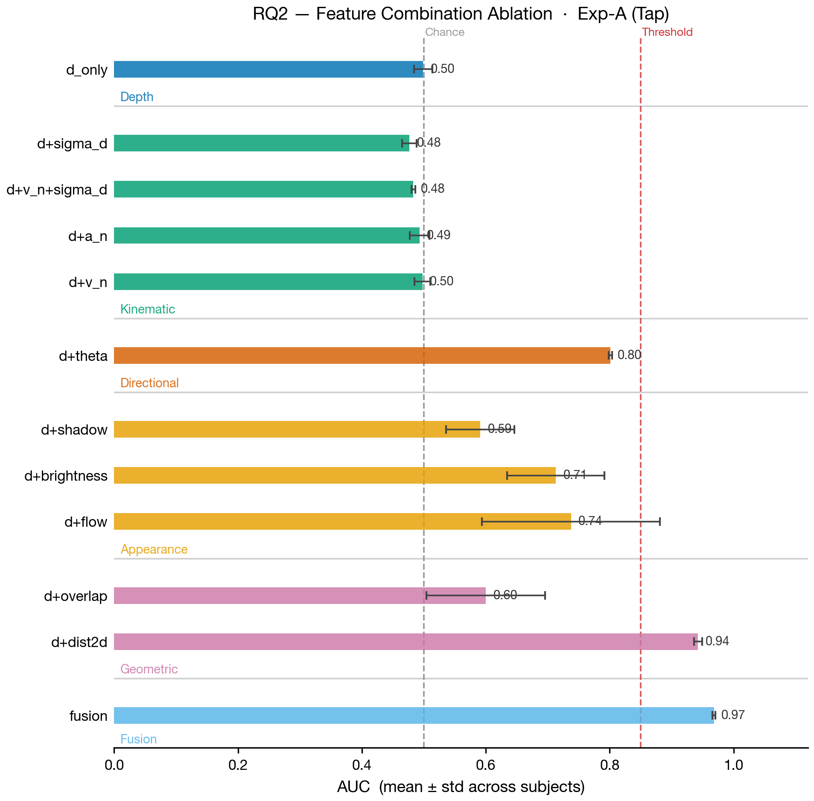
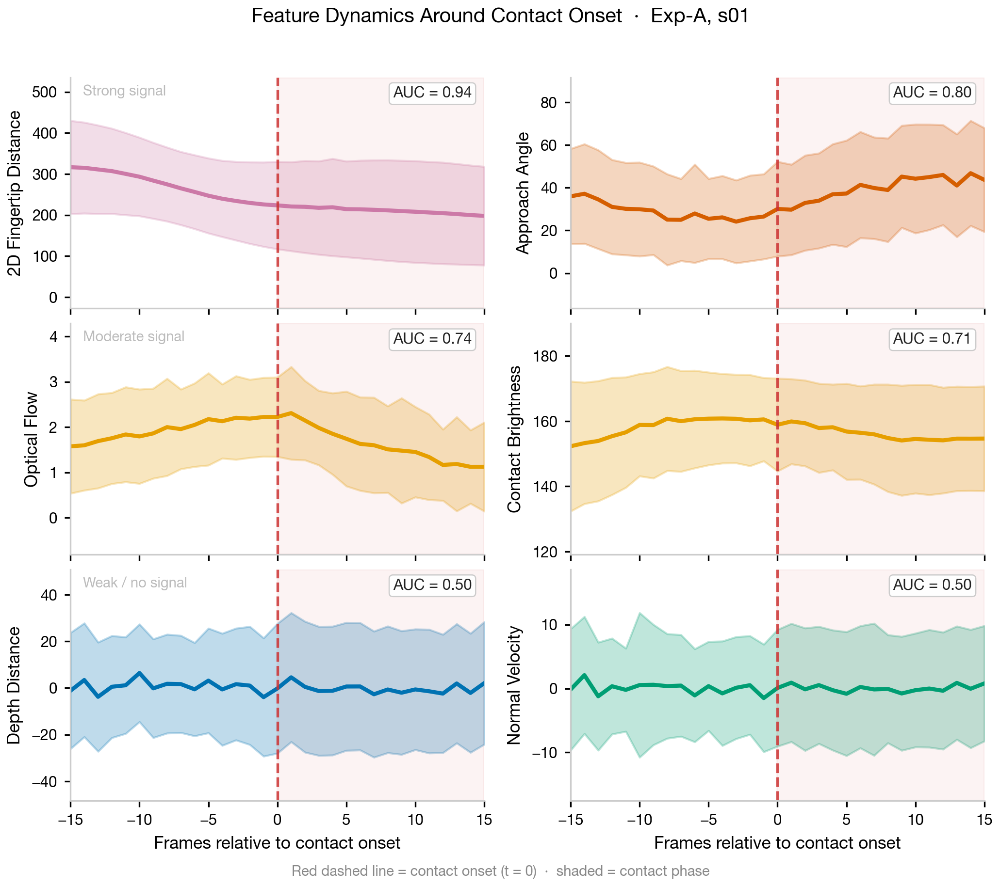
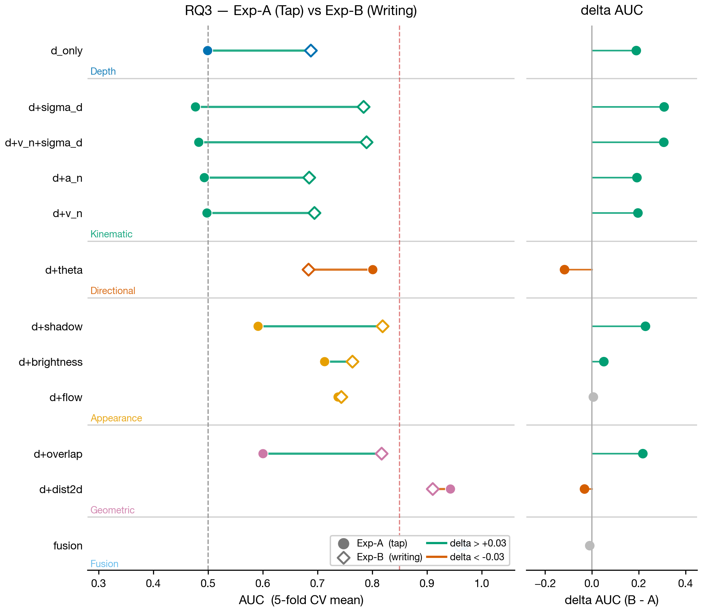
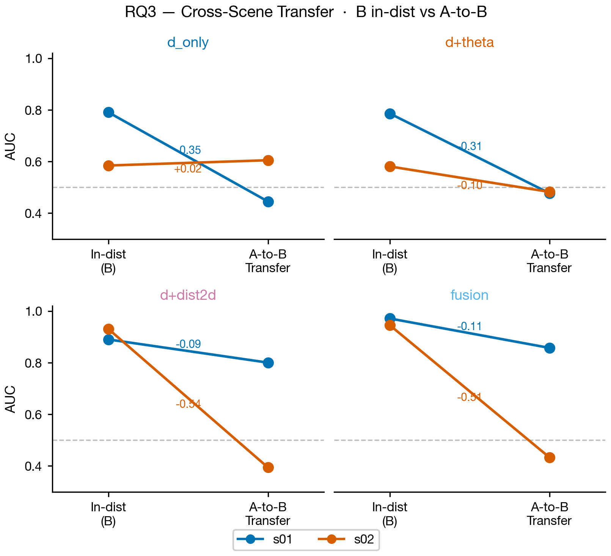

# 接触检测特征分析报告
## RQ2 & RQ3：受控 Tap 场景特征贡献与跨场景泛化

> **数据**：2 名受试者（s01、s02）  
> **Exp-A**（受控 tap）：s01 = 10,869 帧，s02 = 2,557 帧  
> **Exp-B**（书写）：s01 = 1,390 帧，s02 = 2,952 帧  
> **分类器**：LogisticRegression + RobustScaler，5-fold Stratified CV  
> **指标**：ROC-AUC（fold 均值）

---

## 1. 数据与预处理说明

| 场景 | 受试者 | 总帧数 | CONTACT 帧 | IDLE 帧 | 深度 NaN 率 |
|------|--------|--------|-----------|---------|------------|
| Exp-A | s01 | 10,869 | 5,550 (51%) | 5,319 | 40.5% |
| Exp-A | s02 | 2,557  | 1,628 (64%) | 929    | 42.5% |
| Exp-B | s01 | 1,390  | 474 (34%)  | 916    | 31.3% |
| Exp-B | s02 | 2,952  | 1,288 (44%) | 1,664  | 5.5%  |

**深度特征（dist\_raw / dist\_local）的高 NaN 率**来自于：指尖在非接触阶段距离掌面较远时，深度估计失效。这是后续理解"纯深度组合近似随机"的关键背景。

**预处理**：对 `v_t`、`dist2d_palm_*` 做 P1–P99 分位数裁剪（去除长尾异常）；含 NaN 的帧仅在涉及该特征的组合中 dropna，不影响其他组合。

---

## 2. RQ2：受控 Tap 场景（Exp-A）特征贡献

### 2.1 特征组合 AUC

**图 1** — 各特征组合在 Exp-A 中的分类 AUC（横向条形，X 轴从 0 起始以真实反映量级差距）。条形长度为两名受试者的均值，误差棒为标准差；颜色代表特征类别，分组标签标注于各组分隔线上方。灰色虚线 = 随机基线（0.5），红色虚线 = 0.85 实用阈值。

| 特征组合 | Exp-A AUC (mean ± std) | 类别 |
|----------|----------------------|------|
| `d_only` | 0.499 ± 0.015 | 深度 |
| `d+v_n`  | 0.498 ± 0.013 | 运动学 |
| `d+v_n+sigma_d` | 0.483 ± 0.003 | 运动学 |
| `d+sigma_d` | 0.477 ± 0.012 | 运动学 |
| `d+a_n` | 0.493 ± 0.016 | 运动学 |
| `d+shadow` | 0.591 ± 0.055 | 外观 |
| `d+overlap` | 0.600 ± 0.096 | 几何 |
| `d+brightness` | 0.713 ± 0.079 | 外观 |
| `d+flow` | 0.738 ± 0.143 | 外观 |
| `d+theta` | **0.801 ± 0.003** | 方向 |
| `d+dist2d` | **0.943 ± 0.006** | 几何 |
| `fusion`  | **0.968 ± 0.003** | — |

**关键发现 1：深度特征单独无效。**  
`d_only`（dist\_raw + dist\_local）AUC ≈ 0.50，几乎等同于随机猜测。根本原因是深度特征在 Exp-A 中存在约 40% 的 NaN 缺失——指尖远离掌面时深度估计失效，dropna 后有效帧的深度分布不足以区分 CONTACT 与 IDLE。

**关键发现 2：纯运动学特征（v\_n、sigma\_d、a\_n）同样无效。**  
`d+v_n`、`d+sigma_d`、`d+a_n` 等组合 AUC 均在 0.47–0.50 之间。在受控 tap 中，法向速度/加速度的分布在 CONTACT 和 IDLE 帧之间并不线性可分——接触前后存在明显的对称性（接近与离开都有高速度），导致 LogReg 难以区分。

**关键发现 3：几何特征（dist2d\_palm）是最强单项增益。**  
`d+dist2d`（加入 5 个关键点的 2D 像素距离）将 AUC 从随机提升至 **0.943**，受试者间一致性极高（std = 0.006）。这与物理直觉一致：食指接触掌面时，指尖到掌面关键点的像素距离单调减小，几何信号是接触状态的天然代理指标。

**关键发现 4：接近角（approach\_theta）提供强方向性信号。**  
`d+theta` AUC = 0.801，且受试者间方差极小（std = 0.003），说明该特征高度稳健。接触时指尖与掌面法向量的夹角发生明显变化，可作为轻量级高置信度特征。

**关键发现 5：全融合达到最优。**  
`fusion` AUC = 0.968，相比 `d+dist2d` 仅提升 +0.026，边际收益有限，但受试者间一致性进一步提高（std = 0.003）。

---

### 2.2 接触时刻前后特征时序分析（Exp-A, s01）

**图 2** — s01 共 217 个接触事件前后 ±15 帧各特征均值（实线）± 标准差（阴影）。红色虚线为接触起始帧（t = 0）。

**深度特征（dist\_raw / dist\_local）**：NaN 帧较多，有效窗口受限，但可观察到在 t ≈ −5 到 −2 帧之间深度值开始减小，到接触时归零或失效。信号变化窗口窄，噪声大。

**运动学特征（v\_n, a\_n, sigma\_d, v\_t）**：
- `v_n`（法向速度）在 t < 0（接近阶段）出现负值峰谷，在 t > 0（离开阶段）出现正值峰值，两段几乎对称——这解释了为何 LogReg 对 v\_n 的分类效果接近随机：接近与离开在特征空间中相互混叠。  
- `sigma_d`（距离滑窗标准差）在接触前后均偏高，无明显单向信号。  
- `a_n`（法向加速度）在 t = 0 附近存在冲激，但方向不稳定（受个体差异影响大）。

**外观特征（shadow\_score, flow\_mag, brightness\_contact）**：
- `flow_mag`（光流幅值）在接触时刻（t = 0）前后均出现幅值峰值，与"手部快速运动"相关，方差较大（个体差异明显）。  
- `brightness_contact`（接触区域亮度）在 t ≈ −3 到 +3 帧内出现下降，反映阴影效应，但变化量级受光照条件影响。  
- `shadow_score` 在接触时刻呈现微弱降低趋势。

**几何/拓扑特征（dist2d\_palm\_0, hull\_overlap\_ratio）**：
- `dist2d_palm_0`（指尖到掌心 2D 距离）展示出最清晰、最单调的时序模式：从 t = −10 开始持续下降，至 t = 0 达到最小值，之后回升。这是所有特征中**信噪比最高**的时序模式，与其最强 AUC 表现高度一致。  
- `hull_overlap_ratio`（双手凸包重叠比）在接触附近有微弱上升，但绝对变化量小。

---

### 2.3 关键对比 Wilcoxon 检验

| 对比 | ΔAUC (c1 − c2) | n | 说明 |
|------|---------------|---|------|
| `d+v_n+sigma_d` vs `d+dist2d` | −0.460 | 2 | 几何特征远优于纯运动学 |
| `d+dist2d` vs `fusion` | −0.026 | 2 | 融合边际增益有限 |
| `d_only` vs `fusion` | −0.470 | 2 | 单独深度 vs 全融合差距巨大 |

> **⚠️ 局限性**：当前 n = 2 名受试者，Wilcoxon 检验统计效力不足（最小要求 n ≥ 6 方可在 α = 0.05 下获得显著性）。上述数值为**描述性统计**，需扩大样本量后验证。

---

## 3. RQ3：书写场景泛化与跨场景迁移

### 3.1 Exp-A vs Exp-B in-distribution AUC 对比

**图 3** — 左：折线斜率图，每行一个特征组合；实心圆（Exp-A）与空心菱形（Exp-B）由连线相连，连线颜色反映 ΔAUC 方向（绿 = 提升 > +0.03，橙 = 退化 < −0.03，灰 = 基本持平）。右：lollipop 图，直观显示各组合的 ΔAUC 大小与符号。

| 特征组合 | Exp-A | Exp-B | ΔAUC | 解读 |
|----------|-------|-------|------|------|
| `d+theta` | 0.801 | 0.683 | **−0.118** | 接近角在书写场景退化显著 |
| `d+dist2d` | 0.943 | 0.911 | −0.032 | 几何特征跨场景稳健 |
| `fusion` | 0.968 | 0.958 | **−0.010** | 全融合最稳健 |
| `d_only` | 0.499 | 0.688 | +0.189 | 书写场景深度信号更完整 |
| `d+sigma_d` | 0.477 | 0.784 | **+0.307** | 书写时距离标准差更具判别力 |
| `d+shadow` | 0.591 | 0.819 | +0.228 | 书写场景阴影更明显 |
| `d+overlap` | 0.600 | 0.817 | +0.217 | 书写时双手重叠比增大 |

**关键发现 6：几何特征（dist2d）和全融合跨场景最稳健。**  
`d+dist2d` ΔAUC = −0.032，`fusion` ΔAUC = −0.010，说明这两种组合在 tap 和书写两种截然不同的手部动作模式下均保持高判别力。

**关键发现 7：接近角（approach\_theta）在书写场景退化。**  
ΔAUC = −0.118 是所有"Exp-A 强特征"中退化最显著的。书写动作中手指保持近似平行于掌面滑动，法向接近角的变化模式与 tap 的"垂直按压"存在本质差异，导致泛化失败。

**关键发现 8：部分特征在 Exp-B 中表现反而更好。**  
`d_only`（+0.189）、`d+sigma_d`（+0.307）、`d+shadow`（+0.228）在书写场景中 AUC 显著提升。书写任务中指尖长时间保持近距接触，深度信号更连续（NaN 率从 40% 降至 5–31%），运动轨迹更复杂（sigma\_d 增大）。

---

### 3.2 跨场景迁移测试（train Exp-A → test Exp-B）

**图 4** — 2×2 小倍数图，每格对应一个代表性特征组合（d_only / d+theta / d+dist2d / fusion）。X 轴两档：左为 Exp-B in-distribution AUC，右为 A-to-B 直接迁移 AUC；蓝色线 = s01，橙色线 = s02；线段斜率即迁移退化幅度，数字标注于线段中点。

| 特征组合 | B in-dist | A→B 迁移 | ΔTransfer (T−B) |
|----------|-----------|----------|-----------------|
| `d_only` | 0.688 | 0.525 | −0.163 |
| `d+theta` | 0.683 | 0.480 | −0.204 |
| `d+dist2d` | 0.911 | 0.597 | **−0.313** |
| `d+flow` | 0.743 | 0.400 | **−0.343** |
| `fusion` | 0.958 | 0.645 | −0.313 |

**关键发现 9：所有特征组合迁移性均有明显下降，平均退化约 −0.27 AUC。**  
即使是最强的 `fusion` 和 `d+dist2d`，直接跨场景部署后 AUC 跌至 0.60–0.65，不足以用于实用系统。这表明 tap 与书写的特征分布存在系统性差异（distribution shift），不支持 zero-shot 跨场景泛化。

**关键发现 10：受试者间迁移能力差异极大（个体化效应）。**  
以 `fusion` 为例：s01 迁移 AUC = 0.857（接近 in-dist），s02 = 0.433（低于随机）。这一"个体化效应"提示：少量目标场景数据的 **fine-tuning** 或 **个人化校准** 对实用化至关重要。

**关键发现 11：d+theta 迁移至低于随机（AUC = 0.480）。**  
接近角特征在迁移后不仅无效，甚至产生反向分类，说明该特征在两场景中的类别分布方向相反。若将 tap 模型直接部署到书写场景，接近角会作为"反向特征"干扰整体判断。

---

## 4. 综合讨论

### 4.1 核心结论

1. **2D 几何距离（dist2d\_palm）是接触检测的最可靠单一特征组**：在受控 tap（AUC 0.943）和书写（0.911）中均表现稳定，物理可解释性强（空间逼近的直接量化），且对深度缺失不敏感。

2. **深度特征的有效性取决于传感器可靠性**：在高 NaN 率场景下单独失效，但在传感器稳定的条件下（Exp-B s02 NaN 率仅 5.5%）AUC 可达 0.58，可作为几何特征的补充。

3. **全融合（fusion）是最稳健方案**：Exp-A 0.968、Exp-B 0.958，各场景下均为最优，推荐作为系统默认特征集。

4. **运动学特征（v\_n、sigma\_d）在受控 tap 中几乎无贡献**，但在书写场景中因手指运动模式不同而具备一定判别力——**接触检测不应依赖单一运动学假设**。

5. **跨场景 zero-shot 迁移不可行**，需要至少少量目标场景标注数据进行适应（few-shot 迁移或轻量 fine-tuning）。

### 4.2 对系统设计的建议

| 部署场景 | 推荐特征 | 理由 |
|----------|---------|------|
| 受控 tap（Exp-A） | `d+dist2d` 或 `fusion` | 高 AUC，低方差 |
| 书写（Exp-B），有 B 数据 | `fusion` | 各维度均有贡献，AUC 0.958 |
| 书写，仅有 A 训练数据 | **避免直接迁移**；优先收集 10–20 条 B 样本 fine-tune | 迁移退化 ~0.27 |
| 低算力嵌入式部署 | `d+dist2d`（7 维输入） | AUC 0.94/0.91，参数最少 |

### 4.3 局限性

- **样本量 n = 2**：所有跨受试者统计（mean ± std、Wilcoxon）均为描述性，不具备统计显著性。后续需扩充至 ≥ 8 名受试者以支撑顶会级别的统计主张。
- **Exp-B 受试者条件不匹配**：s01 为 normal\_normal，s02 为 low\_fast，导致跨场景比较中混入了书写速度/力度的变化。建议后续实验统一条件。
- **分类器选择**：LogisticRegression 假设特征线性可分。部分特征（如 v\_n 的双峰分布）可能需要非线性分类器（如 SVM-RBF 或轻量神经网络）以获得更高上限 AUC。

---

## 5. 数值附录

完整数值结果见 [`figures/rq2_rq3_results.csv`](figures/rq2_rq3_results.csv)，Wilcoxon 检验结果见 [`figures/rq2_wilcoxon.csv`](figures/rq2_wilcoxon.csv)。

### 完整 AUC 表

| 特征组合 | A mean | A std | B mean | B std | ΔAUC (B−A) | Transfer | Δ (T−B) |
|----------|--------|-------|--------|-------|-----------|----------|---------|
| d_only | 0.4988 | 0.0149 | 0.6878 | 0.1031 | +0.1890 | 0.5251 | −0.1626 |
| d+v_n | 0.4978 | 0.0128 | 0.6944 | 0.1096 | +0.1966 | 0.5201 | −0.1742 |
| d+sigma_d | 0.4769 | 0.0117 | 0.7843 | 0.0015 | +0.3074 | 0.5195 | −0.2647 |
| d+v_n+sigma_d | 0.4830 | 0.0033 | 0.7892 | 0.0136 | +0.3062 | 0.5183 | −0.2708 |
| d+a_n | 0.4929 | 0.0158 | 0.6846 | 0.1007 | +0.1917 | 0.5165 | −0.1682 |
| d+theta | 0.8010 | 0.0029 | 0.6834 | 0.1025 | **−0.1176** | 0.4799 | −0.2035 |
| d+shadow | 0.5910 | 0.0548 | 0.8187 | 0.0624 | +0.2277 | 0.5003 | −0.3184 |
| d+flow | 0.7375 | 0.1434 | 0.7434 | 0.1528 | +0.0059 | 0.3999 | −0.3434 |
| d+brightness | 0.7129 | 0.0786 | 0.7635 | 0.0714 | +0.0506 | 0.5771 | −0.1865 |
| d+dist2d | **0.9425** | 0.0064 | **0.9105** | 0.0204 | −0.0320 | 0.5972 | −0.3133 |
| d+overlap | 0.6000 | 0.0959 | 0.8170 | 0.0274 | +0.2170 | 0.5067 | −0.3102 |
| **fusion** | **0.9683** | 0.0026 | **0.9582** | 0.0131 | −0.0101 | **0.6452** | −0.3130 |

---

*Generated by `experiments/analysis_rq2_rq3.py`*
