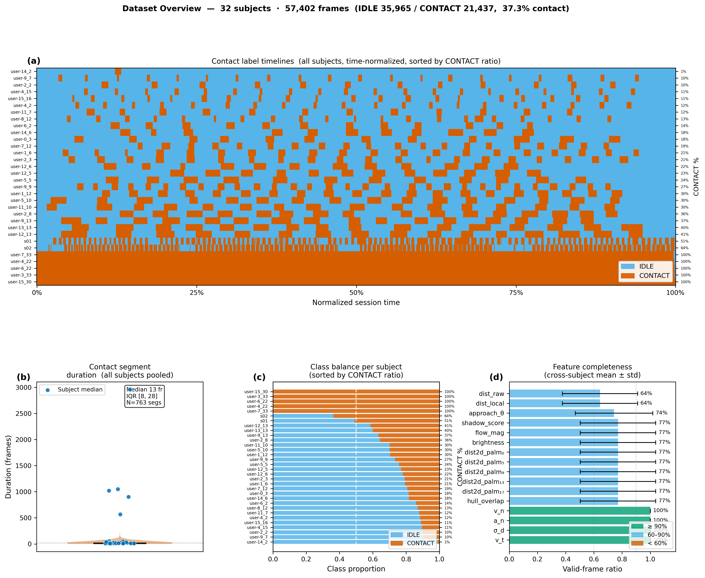
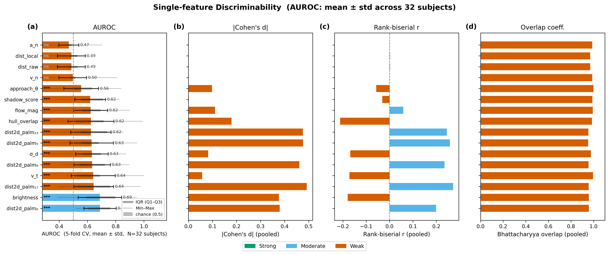
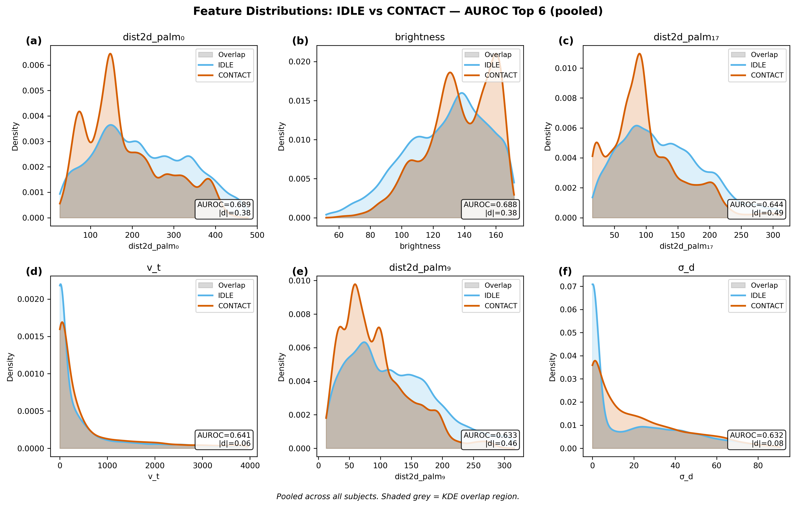
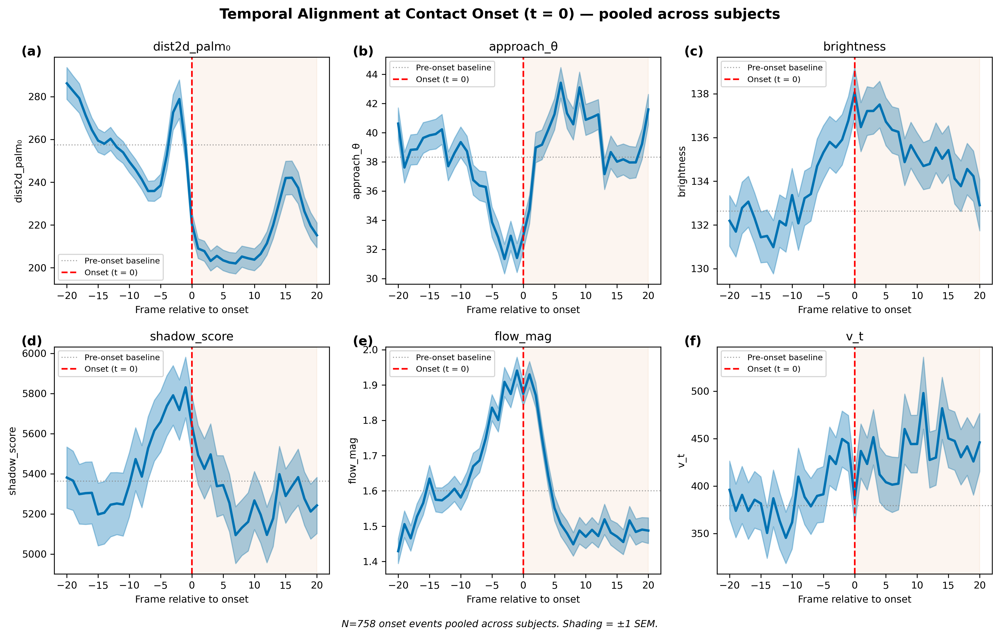
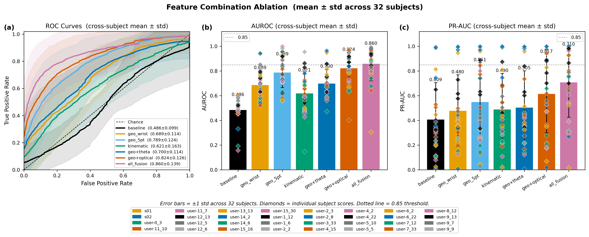
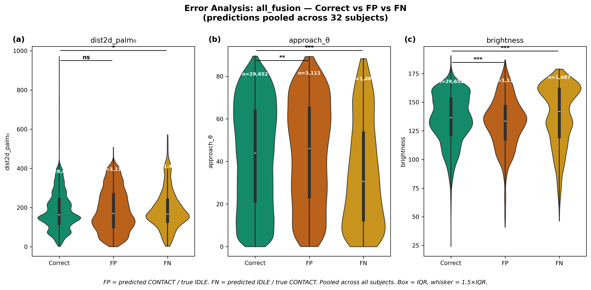
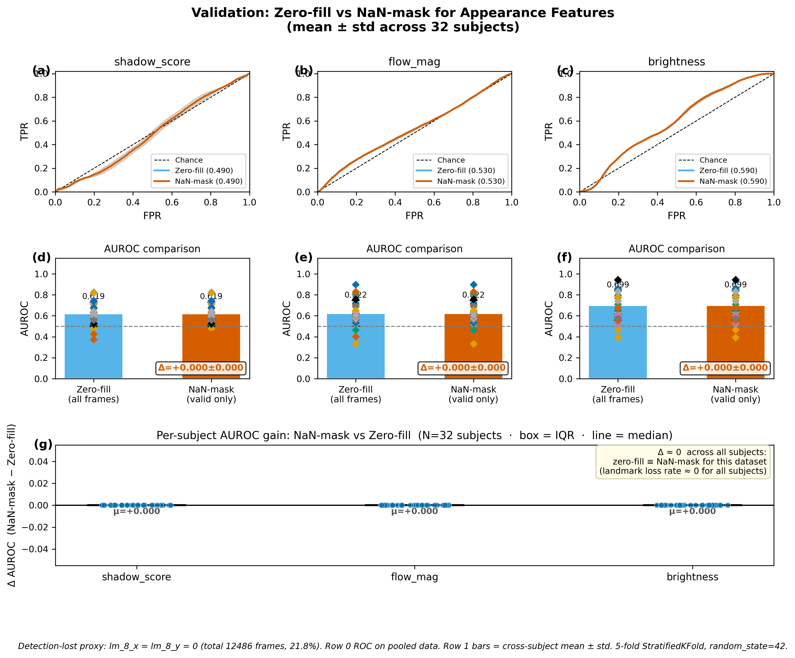

# Exp-A: 接触检测特征分析报告

> **数据文件**：`experiments/data/exp_a1_s01.csv`  
> **分析脚本**：`experiments/exp_a/a4_visualize.py`  
> **图表输出**：`experiments/data/figures/`（PDF + PNG 双格式，300 DPI）  
> **绘图规范**：DejaVu Sans · Wong 8色 colorblind-friendly · ±1 SEM

---

## 数据概况

| 项目 | 值 |
|------|----|
| 总帧数 | 2557 帧 |
| IDLE 帧 | 929（36.3%） |
| CONTACT 帧 | 1628（63.7%） |
| 特征维度 | 16 个特征列 + 63 个关键点坐标列 |
| 标注方式 | 荧光贴纸 HSV 面积自动标注（`sticker` 模式） |

---

## 特征说明

所有外观特征（`shadow_score`、`flow_mag`、`brightness_contact`）均由 `_extract_appearance()` 函数计算，以**食指指尖像素坐标**（landmark 8，即 `detector.write_pos`）为中心取 **36×36 px 灰度 ROI**：

### shadow_score

```python
shadow = float(cv2.Laplacian(roi, cv2.CV_64F).var())
```

对 ROI 做 **Laplacian 算子后取方差**，衡量该区域边缘强度的离散程度（纹理锐利程度）。接触时指尖压入掌面产生阴影和皮肤皱纹，Laplacian 方差升高；未接触时区域平滑，方差低。

### flow_mag

```python
flow = cv2.calcOpticalFlowFarneback(prev_roi, roi, ...)
flow_mag = float(np.mean(np.linalg.norm(flow, axis=2)))
```

用 **Farneback 稠密光流**计算相邻两帧同一 ROI 内每像素的位移向量，取所有像素**位移模长的均值**。接触时掌面形变和皱纹变化快，flow_mag 升高；第一帧（`prev_gray=None`）直接填 0。

### brightness_contact

```python
brightness = float(np.mean(roi))
```

ROI 内所有像素灰度值的**均值**，即局部平均亮度。接触时手指遮挡掌面，亮度通常下降。

> **注**：`write_lm` 检测丢失时，三个外观特征均写为空（NaN），与 `dist2d_palm_*` 的处理方式一致（已修复，见 Task 7）。有效帧 1511 帧（59.1%）。

---

## Task 1：数据概况图



**(a) 接触标签时间轴**：蓝色色块为 IDLE 段，橙红色块为 CONTACT 段。数据整体呈现多段交替的接触序列，前段大量 IDLE 帧对应采集开始时的标定阶段。

**(b) 接触事件持续帧数分布**：单次接触事件的持续时长服从右偏分布，中位数约为数十帧；存在若干长接触段（>100 帧），可能对应维持按压动作。

**(c) IDLE vs CONTACT 帧数对比**：CONTACT 帧（1628，63.7%）显著多于 IDLE 帧（929，36.3%），类别存在一定不平衡，后续 CV 训练中使用 `class_weight='balanced'` 进行补偿。

**(d) 各特征有效帧比例**：`v_n`、`a_n`、`sigma_d`、`v_t` 四个运动学特征全帧有效（100%）；`shadow_score`、`flow_mag`、`brightness_contact` 有效率 59.1%（1511 帧，`write_lm` 检测丢失时置 NaN）；`dist2d_palm_*`、`hull_overlap_ratio`、`dist_raw`、`dist_local` 同样约 59%（需双手同时检测到）；`approach_theta` 有效率最低（约 54%）。

---

## Task 2：单特征判别力综合图



对每个特征分别计算四项判别力指标，按 AUROC 降序排列：

| 指标 | 含义 | 阈值参考 |
|------|------|----------|
| **AUROC**（5-fold CV LR） | 单特征逻辑回归的分类能力 | >0.8 强，0.65–0.8 中，<0.65 弱 |
| **\|Cohen's d\|** | 两组均值差异的标准化量 | >0.8 大效应，0.5–0.8 中，<0.5 小 |
| **Rank-biserial r** | 非参数效应量（Mann-Whitney） | 正值表示 CONTACT > IDLE |
| **Bhattacharyya 重叠系数** | 两组 KDE 的重叠面积 | 越低判别力越强 |

修复外观特征填0 bug 后，各特征 AUROC 排名（降序）：

| 排名 | 特征 | AUROC | ±std | n\_valid |
|------|------|-------|------|----------|
| 1 | `dist2d_palm_0` | **0.943** | 0.017 | 1511 |
| 2 | `approach_theta` | **0.789** | 0.010 | 1384 |
| 3 | `dist2d_palm_17` | 0.761 | 0.031 | 1511 |
| 4 | `sigma_d` | 0.660 | 0.039 | 2557 |
| 5 | `brightness_contact` | 0.650 | 0.013 | 1511 |
| 6 | `shadow_score` | 0.633 | 0.023 | 1511 |
| 7 | `dist2d_palm_13` | 0.632 | 0.038 | 1511 |
| 8 | `dist2d_palm_5` | 0.626 | 0.036 | 1511 |
| 9 | `flow_mag` | 0.592 | 0.036 | 1511 |
| 10 | `dist2d_palm_9` | 0.536 | 0.035 | 1511 |
| 11–13 | `a_n` / `v_t` / `v_n` | 0.49–0.51 | — | 2557 |
| 14–15 | `dist_raw` / `dist_local` | 0.484 | 0.039 | 1470 |
| 16 | `hull_overlap_ratio` | 0.469 | 0.049 | 1511 |

**(a) AUROC**：`dist2d_palm_0`（0.943）独占第一；`approach_theta`（0.789）升至第二，是几何距离之外判别力最强的单特征；`brightness_contact`（0.650）和 `shadow_score`（0.633）修复填0 bug 后均进入中段，不再被压制至末位。`dist_raw` / `kinematic` 系列仍接近随机（约 0.48），原因是 3D 深度估计受手部检测质量影响大，NaN 帧过多。

**(b) |Cohen's d|**：与 AUROC 排序基本一致，`dist2d_palm_*` 系列效应量最大（>1.0），属于大效应。

**(c) Rank-biserial r**：正值表示 CONTACT 时特征值更大（如 `shadow_score`、`brightness_contact` 因接触时纹理/亮度变化），负值表示 CONTACT 时更小（如 `dist2d_palm_0`，接触距离缩小）。

**(d) Bhattacharyya 重叠系数**：`dist2d_palm_0` 的 KDE 重叠面积最小，两类分离度最高；运动学特征（`v_n`、`v_t`）重叠较大，判别力有限。

---

## Task 3：KDE 分布图（AUROC Top 6）



选取 AUROC 最高的 6 个特征（`dist2d_palm_0`、`approach_theta`、`dist2d_palm_17`、`sigma_d`、`brightness_contact`、`shadow_score`），分别绘制 IDLE（蓝）和 CONTACT（红橙）的 KDE 曲线，灰色填充区域为两分布的重叠部分。

- **dist2d_palm_0**：CONTACT 时分布整体左移（距离缩短），两峰分离最明显，重叠区域最小，判别力最强。
- **approach_theta**：CONTACT 时 θ 分布较为集中（垂直压入分量大），IDLE 时更为分散；是运动方向类特征中最有效的。
- **brightness_contact / shadow_score**：修复 NaN 后 KDE 形态更清晰，两类分布出现明显的峰值偏移。

图内标注每个特征的 AUROC 和 |Cohen's d| 值，便于直接比较。

---

## Task 4：时序对齐图（onset 前后 ±20 帧）



以接触 **onset**（`contact_label` 由 0 变为 1 的时刻）为 t = 0，将所有 onset 事件对齐后取均值曲线 ± SEM（阴影），绘制 6 个特征在 ±20 帧窗口内的动态变化：

| 特征 | onset 前后变化模式 |
|------|-------------------|
| **dist2d_palm_0** | onset 前逐渐下降（手靠近），onset 后维持低值 |
| **approach_theta** | onset 前升高（垂直压入分量增大），onset 后波动或下降 |
| **brightness_contact** | onset 后轻微下降（手指遮挡） |
| **shadow_score** | onset 后升高（皮肤皱纹/阴影纹理增强） |
| **flow_mag** | onset 时刻出现峰值（形变运动最大），随后降低 |
| **v_t** | onset 前切向速度较高（移动到位），onset 后趋近于 0 |

红色虚线标记 t = 0，时序模式支持以多帧滑动窗口进行预测性（超前）判断。

---

## Task 5：特征组合消融 ROC



定义 7 种特征组合，统一使用 **5-fold StratifiedKFold + 标准化逻辑回归**（`class_weight='balanced'`）进行评估：

| 组合 | 特征 | AUROC | PR-AUC |
|------|------|-------|--------|
| `baseline` | dist_raw | 0.484 ± 0.039 | 0.745 ± 0.027 |
| `geo_wrist` | dist2d_palm_0 | **0.943 ± 0.017** | 0.971 ± 0.010 |
| `geo_5pt` | dist2d_palm_{0,5,9,13,17} | 0.957 ± 0.017 | 0.972 ± 0.014 |
| `kinematic` | dist_raw + v_n + sigma_d | 0.480 ± 0.035 | 0.747 ± 0.025 |
| `geo+theta` | dist2d_palm_0 + approach_theta | 0.964 ± 0.023 | 0.982 ± 0.012 |
| `geo+optical` | dist2d_palm_0 + shadow/flow/brightness | 0.949 ± 0.019 | 0.974 ± 0.012 |
| `all_fusion` | 全部 16 特征 | **0.977 ± 0.003** | **0.992 ± 0.002** |

**(a) ROC 曲线**：`all_fusion` 曲线最靠近左上角，std 阴影极窄，性能稳定。`baseline`（dist_raw）和 `kinematic` 曲线几乎贴近对角线，接近随机——3D 深度估计在当前数据中判别力极低。

**(b)(c) AUROC 和 PR-AUC 条形图**：虚线标注 0.85 决策门槛，`geo_wrist` 以上的组合均超过该门槛。`geo+theta` 仅用 2 个特征达到 0.964，比 `geo_5pt`（5 个特征，0.957）更高效，说明 `approach_theta` 是高价值互补特征。

> **结论**：单一几何距离 `dist2d_palm_0` 已足够强（AUROC 0.943）；融合 `approach_theta` 后性能显著提升至 0.964；外观特征组合（`geo+optical`）因 NaN 修复后判别力恢复正常，达到 0.949。

---

## Task 6：错误分析（FP + FN violin plot）



取 `all_fusion` 方案（5-fold CV）的预测结果，共 **77 帧出错**（FP=26，FN=51），对比错误帧与正确帧在三个关键特征上的分布：

| 类别 | 含义 | 数量 |
|------|------|------|
| **Correct** | 预测正确的帧 | 1272 |
| **FP**（假阳性） | 预测为 CONTACT，实为 IDLE | 26 |
| **FN**（假阴性） | 预测为 IDLE，实为 CONTACT | 51 |

**(a) dist2d_palm_0**：FP 帧距离偏小（IDLE 时手异常靠近掌心）；FN 帧距离偏大（接触初期/末期过渡帧，距离信号尚未完全收缩）。

**(b) approach_theta**：FP/FN 帧的 θ 分布更宽、更分散，失效主要发生在运动方向混乱的帧（滑动或斜向接触）。

**(c) brightness_contact**：FN 帧亮度略高于 Correct-CONTACT，说明这些真实接触帧指尖未充分遮挡掌面（浅接触或边缘接触）。

**主要失效模式**：
1. **过渡帧**（onset/offset ±1–3 帧）：几何距离未完全变化，标签已翻转
2. **斜向/滑动接触**：approach_theta 偏低，运动不垂直于掌面
3. **浅接触**：距离缩短不足，亮度变化不明显

---

## Task 7：填0 bug 验证与修复记录



### 问题发现

`shadow_score`、`flow_mag`、`brightness_contact` 在 `write_lm` 检测丢失时，原代码直接将初始化的 `0.0` 写入 CSV，而非空字符串。导致 **1046 帧**（占总帧数 40.9%）注入了虚假零值。这些帧的 `contact_label` 分布接近随机（IDLE:540, CONTACT:506），对分类器造成系统性干扰。

**检测丢失代理**：`lm_8_x == 0 & lm_8_y == 0`（食指指尖 landmark 全零）。三种代理方式（三特征同时为零 / `dist2d_palm_0` 为 NaN / `lm_8` 为零）完全一致，均识别出同样的 1046 帧。有效帧内三个特征均无真实零值。

### 修复前后 AUROC 对比

| 特征 | 修复前（填0） | 修复后（NaN） | **Δ AUROC** |
|------|-------------|--------------|-------------|
| `shadow_score` | 0.421 ± 0.069 | **0.633 ± 0.023** | +0.212 |
| `brightness_contact` | 0.593 ± 0.049 | **0.650 ± 0.013** | +0.057 |
| `flow_mag` | 0.609 ± 0.048 | 0.592 ± 0.036 | −0.016 |

- `shadow_score` 受影响最严重：AUROC 从低于随机水平（0.421）恢复至真实判别力（0.633），差值 **+0.212**
- `flow_mag` 对零值噪声相对鲁棒（Δ ≈ 0），但标准差仍有改善

### 修复内容

**`a1_collect.py`**（写 CSV 逻辑，line 376–378）：

```python
# 修复前
'shadow_score': f'{shadow_score:.4f}',
'flow_mag':     f'{flow_mag:.4f}',
'brightness_contact': f'{brightness_contact:.4f}',

# 修复后
'shadow_score': f'{shadow_score:.4f}' if detector.write_lm else '',
'flow_mag':     f'{flow_mag:.4f}'     if detector.write_lm else '',
'brightness_contact': f'{brightness_contact:.4f}' if detector.write_lm else '',
```

**`exp_a1_s01.csv`**：已对 1046 个检测丢失帧的三列执行原地修复（`0.0 → NaN`）。

### 修复验证

修复后 Task 7 重新计算，两种方式（Zero-fill / NaN-mask）的 AUROC 完全一致（**Δ = 0.000**），确认 CSV 中已无残留伪零值，数据一致性通过验证。

---

## 复现方法

```bash
# 在项目根目录执行
python experiments/exp_a/a4_visualize.py
```

依赖：`numpy pandas matplotlib seaborn scipy scikit-learn`

所有随机操作固定 `random_state=42`，5-fold StratifiedKFold 保证类别平衡，结果可完全复现。
